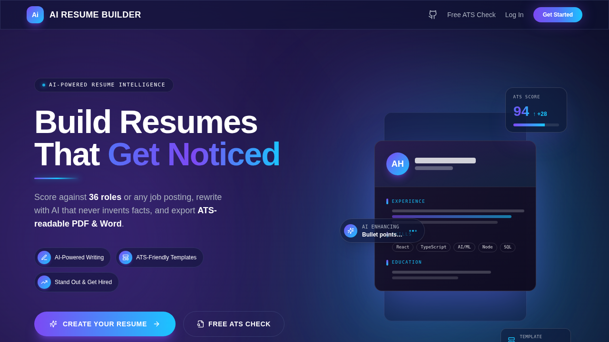
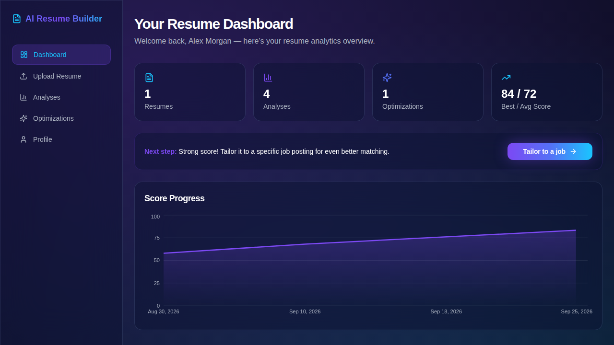
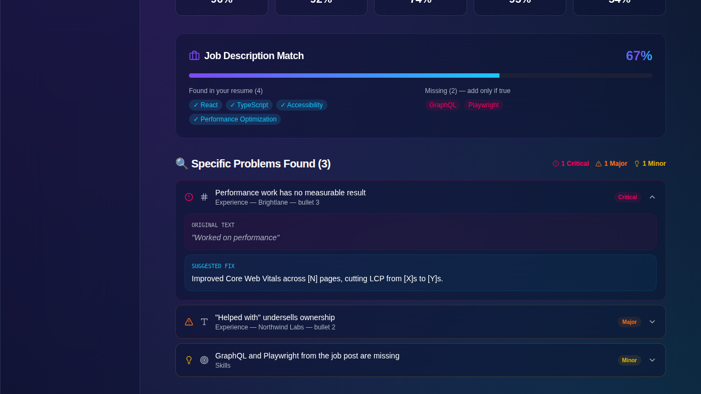
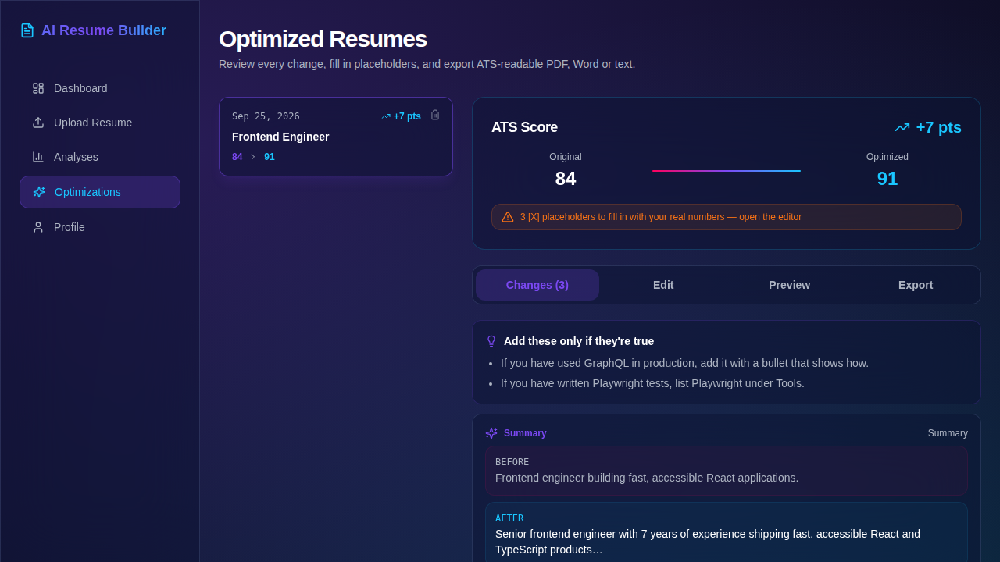
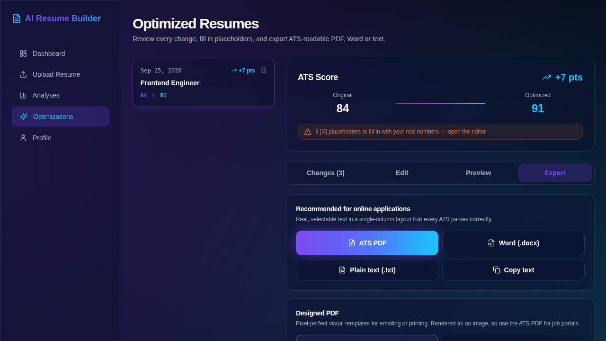
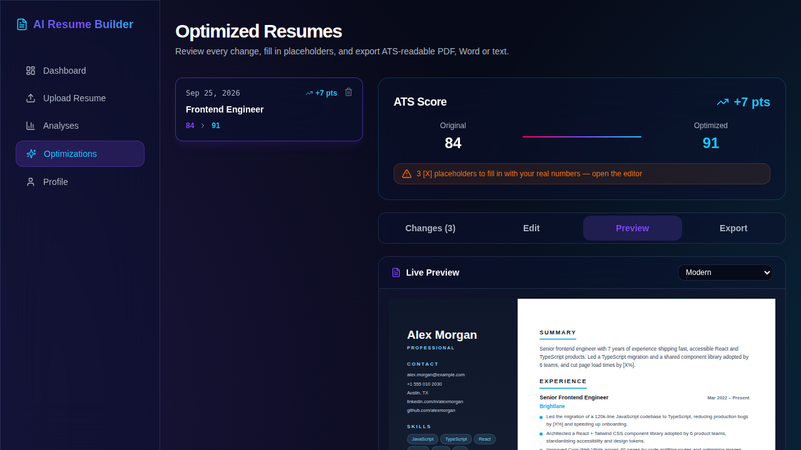
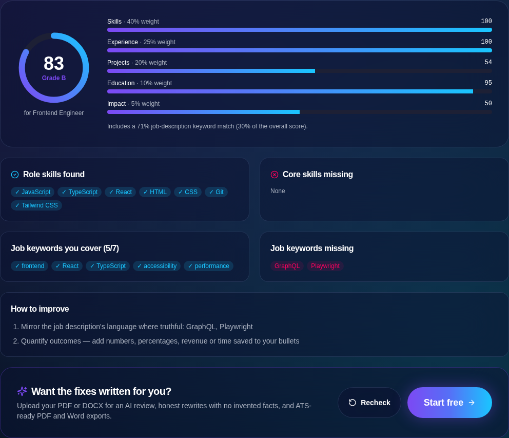
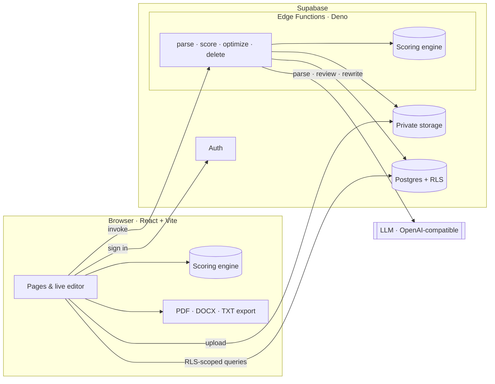

<div align="center">

# 🤖 AI Resume Builder

### Score your resume against any job → rewrite it with AI that never invents facts → export ATS-readable PDF & Word

[](https://resume-constructor-gev44.vercel.app)
&nbsp;
[](https://resume-constructor-gev44.vercel.app/ats-checker)
&nbsp;
[](https://github.com/GEV44/resume-constructor/actions/workflows/ci.yml)
&nbsp;
[](LICENSE)

<br/>


**🌐 [resume-constructor-gev44.vercel.app](https://resume-constructor-gev44.vercel.app)**

</div>

---

<p align="center">
  
</p>

## ✨ Overview

**AI Resume Builder** is a full-stack web app that helps job seekers measure and improve their resumes objectively. Upload a PDF or DOCX and the app parses it into structured data, then scores it against one of **36 job roles**, and optionally a specific job posting, with a **deterministic engine**: the same input always gives the same score. AI rewrites make bullets sharper and add keywords **without inventing facts**. Where a number would help, the AI leaves an `[X]` placeholder for you to fill in. Export an **ATS-readable PDF or Word file**, or choose one of 10 designed templates.

## 🎯 Features

| | Feature | Description |
|:---:|---|---|
| 📄 | **Resume Parsing** | AI extracts contact details, experience, skills, projects and education. DOCX text is extracted on the server; file signatures are checked. |
| 📊 | **Deterministic Scoring** | One transparent engine shared by the browser and the server. Weights differ by role category. Skill aliases (JS, k8s, Postgres…) are recognised. |
| 🎯 | **Job-Description Match** | Paste a job posting to see which hard-skill keywords you cover and which you're missing. The match counts for 30% of the score. |
| 🤖 | **Honest AI Optimization** | Rewrites are merged back into your original facts by position, so employers, titles, dates and degrees can't change. A new skill is kept only if your resume already shows evidence of it. |
| ✍️ | **In-app Editor** | Fill in `[X]` placeholders and tweak bullets while the ATS score updates live. |
| 🧾 | **ATS-Readable Exports** | Real-text PDF, Word (.docx) and plain text, plus 10 designed PDF templates for printing and email. |
| 📈 | **Progress Tracking** | Score-trend chart, full analysis history, and a before/after comparison re-scored by the same engine. |
| 🔒 | **Privacy & Security** | Row-level security, per-user hourly AI limits, security headers, one-click data export and account deletion. |

## 📸 Screenshots

| Dashboard: score trend and next step | Analysis: AI findings and job match |
|:---:|:---:|
|  |  |
| **Optimization: tracked changes and honest suggestions** | **Export: ATS-readable PDF, Word and text** |
|  |  |
| **Live template preview** | **Free ATS checker (no signup, runs in the browser)** |
|  |  |

## 🏗️ Architecture



The **same `scoring.ts` module** runs in the browser (live editor, free checker) and in the edge functions (stored scores), so the score a user sees is always the one that gets saved.

### How the score works

| Component | What it measures |
|---|---|
| **Skills** | Required skills found (100%) plus preferred skills (up to +50%), with aliases and multi-word matching |
| **Experience** | Years against the role's minimum, plus role keywords in context |
| **Projects** | Share of projects using role-relevant technology, with outcomes stated |
| **Education** | Degree level plus a bonus for a relevant field (whole-word matching) |
| **Impact** | Quantified achievements: how many there are and what share of bullets have one |
| **Job match** *(optional)* | Coverage of hard-skill keywords extracted from the pasted job description (30% of the total) |

Component weights depend on the role category. Tech roles, for example, weight projects at 20%, while Business, Finance and HR roles weight them at 5%.

### Why the AI can't make things up

1. The model only returns rewritten **bullets and a summary, keyed by position**. The server merges them onto the original parse, so employers, titles, dates and degrees are never taken from the model.
2. A skill the model adds is kept **only if the resume already shows evidence of it**. Anything else becomes an "add only if true" suggestion.
3. Numbers not in the source become **`[X]` placeholders**. The editor tracks them and warns before export.
4. Before and after scores are both **recomputed by the deterministic engine**, never estimated by the model.

## 🧱 Tech Stack

| Layer | Technologies |
|---|---|
| **Frontend** | React 18 · TypeScript · Vite (route-level code splitting) · Tailwind CSS · shadcn/ui · Framer Motion · Recharts |
| **Backend** | Supabase: Auth, Postgres with RLS, Storage, Edge Functions (Deno) |
| **AI** | Any OpenAI-compatible endpoint. Default: Google Gemini Flash via the Lovable AI Gateway |
| **Exports** | jsPDF (text PDF) · docx (Word) · html2canvas (designed templates) |
| **Quality** | Vitest (unit) · Playwright (E2E on desktop and mobile) · ESLint · `deno check` · GitHub Actions CI · Dependabot |
| **Hosting** | Vercel |

## 🚀 Getting Started

**Prerequisites:** Node.js 20+, a Supabase project and, to deploy functions, the [Supabase CLI](https://supabase.com/docs/guides/cli).

```bash
git clone https://github.com/GEV44/resume-constructor.git
cd resume-constructor
npm install
cp .env.example .env      # add your Supabase URL and publishable key
npm run dev               # http://localhost:5173
```

### Backend (Supabase)

```bash
supabase link --project-ref <your-project-ref>
supabase db push                                   # apply migrations
supabase secrets set AI_API_KEY=... ALLOWED_ORIGINS=https://your-domain.com
supabase functions deploy parse-resume score-resume optimize-resume delete-account
```

In **Auth → URL Configuration**, add `https://your-domain.com/reset-password` as a redirect URL so password-reset emails work.

### Quality checks

```bash
npm run ci                # lint + typecheck + unit tests + production build
npm run test:e2e          # Playwright: public pages + signed-in flows against a mocked backend
npm run check:functions   # type-check edge functions (requires Deno)
```

CI runs all three on every push and pull request. The end-to-end suite also downloads the ATS PDF and checks that it contains real text.

## 📁 Project Structure

```
src/
├── pages/            Landing · AtsChecker · Dashboard · UploadResume · AnalysisResult · Optimizations · Profile · auth pages
├── components/       Seo · DashboardLayout · ProtectedRoute · ErrorBoundary · ui/ (shadcn)
├── contexts/         AuthContext (Supabase session)
├── integrations/     Supabase client & generated types
└── lib/
    ├── resume-pdf.ts     10 designed templates + image-PDF export
    ├── resume-export.ts  ATS text-PDF, DOCX and plain-text export
    ├── scoring.ts        re-exports the shared scoring engine
    ├── quick-parse.ts    offline text parser for the free checker
    └── format.ts         shared UI formatting helpers
supabase/
├── functions/
│   ├── _shared/      scoring.ts · job-roles.ts (shared with the web app) · ai.ts · http.ts
│   ├── parse-resume · score-resume · optimize-resume · delete-account
└── migrations/
e2e/                  Playwright specs + mocked Supabase backend
docs/screenshots/     README images (regenerated by the E2E suite)
```

## 🔧 Configuration

**Web app (`.env`)**

| Variable | Purpose |
|---|---|
| `VITE_SUPABASE_URL` / `VITE_SUPABASE_PUBLISHABLE_KEY` | Supabase project URL and public (anon/publishable) key |
| `VITE_SITE_URL` | Canonical URL for SEO, the sitemap and Open Graph tags |

**Edge function secrets (`supabase secrets set`)**

| Secret | Default | Purpose |
|---|---|---|
| `AI_API_KEY` | falls back to `LOVABLE_API_KEY` | Key for the AI endpoint |
| `AI_BASE_URL` | `https://ai.gateway.lovable.dev/v1` | Any OpenAI-compatible `/chat/completions` base URL |
| `AI_MODEL` | `google/gemini-3-flash-preview` | Model id |
| `ALLOWED_ORIGINS` | `*` | Comma-separated CORS allow-list |
| `PARSE_LIMIT_PER_HOUR` / `SCORE_LIMIT_PER_HOUR` / `OPTIMIZE_LIMIT_PER_HOUR` | 20 / 30 / 15 | Per-user hourly AI quotas |

## 🤝 Contributing & security

See [CONTRIBUTING.md](CONTRIBUTING.md), [SECURITY.md](SECURITY.md) and the [CHANGELOG](CHANGELOG.md).

## 👤 Author

**Gevorg Hovhannisyan** — Data Scientist & ML Engineer · Yerevan, Armenia

[](https://github.com/GEV44)
[](https://www.linkedin.com/in/gevorg-hovhannisyan-arm/)

## 📄 License

Released under the [MIT License](LICENSE).
